# flowable 学习

## flowable UI IDM 模块总览

我们可以通过IdmEngine操作IDM相关的表,也可以通过processEngin操作相关的表。

大体上IDM模块是一个RBAC模型,从角色-组-权限来限制或授予用户的访问权限。与普通RBAC模型不同的是,IDM模块的权限可以直接分配到某一个特定的用户。如图

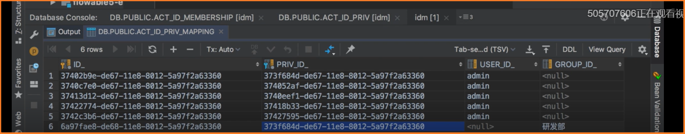

可以看到权限-组中间表中也可以设置权限直接到用户的关系。

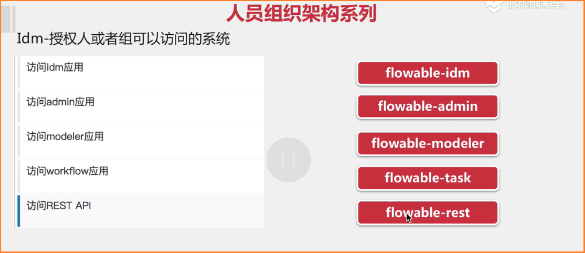这里是权限相关关系。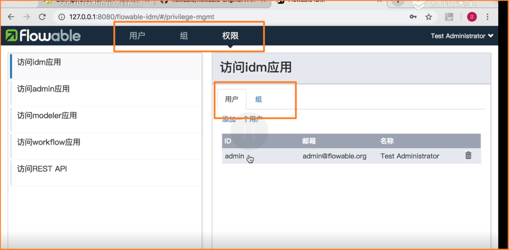

如图,全向模块不光可以设置组(角色)还可以将权限直接对应到某个用户!

## IDM模块的H2数据库

如果我们想要连接IDM模块的H2数据库,必须要保证项目是启动的,否则连接不上H2数据库的。

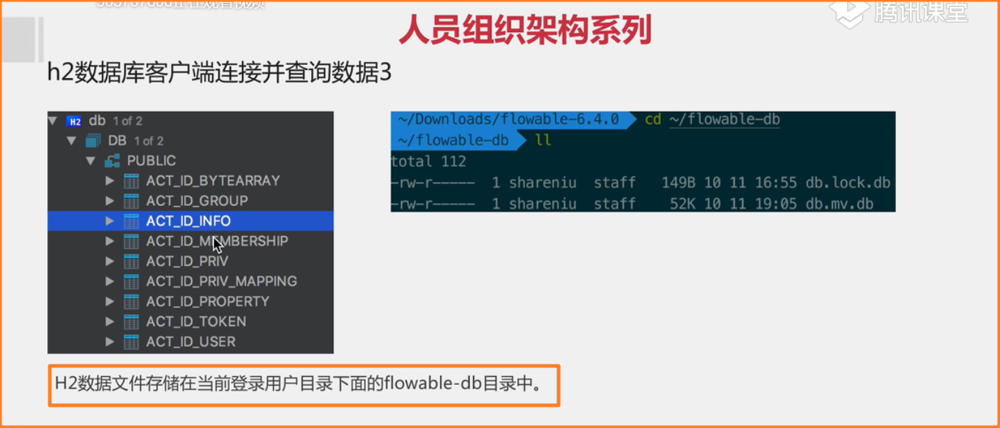

大概有9张表

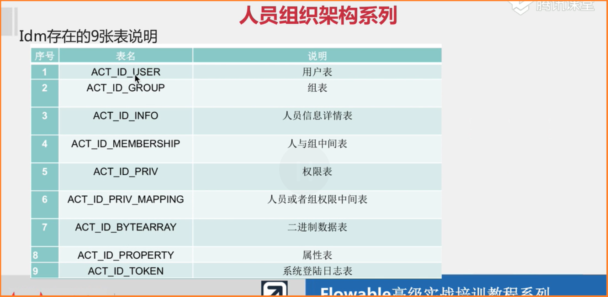

属性表中的数据一定不要删除

系统登录日志表如果将记录删除,那当前登录的用户就会被踢出。

以上9张表中有2张表在6.40版本被废弃了

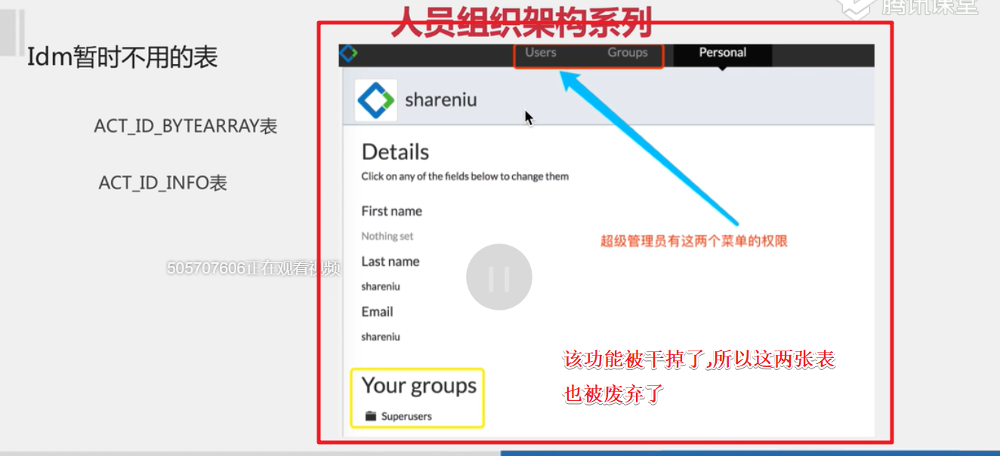

注意,在项目启动的时候我们是没有办法删除h2的db文件的,想要删除db文件一定要先将项目关闭!

## 5-4H2清空及默认用户修改

H2数据库虽然是内存数据库,但是也会将数据保存在一个目录,内存数据库的含义应该是在内存中运行的数据库而不是把数据保存在内存的数据库。

项目一旦被关闭,就无法访问H2内嵌数据库了。

默认创建的管理员帐号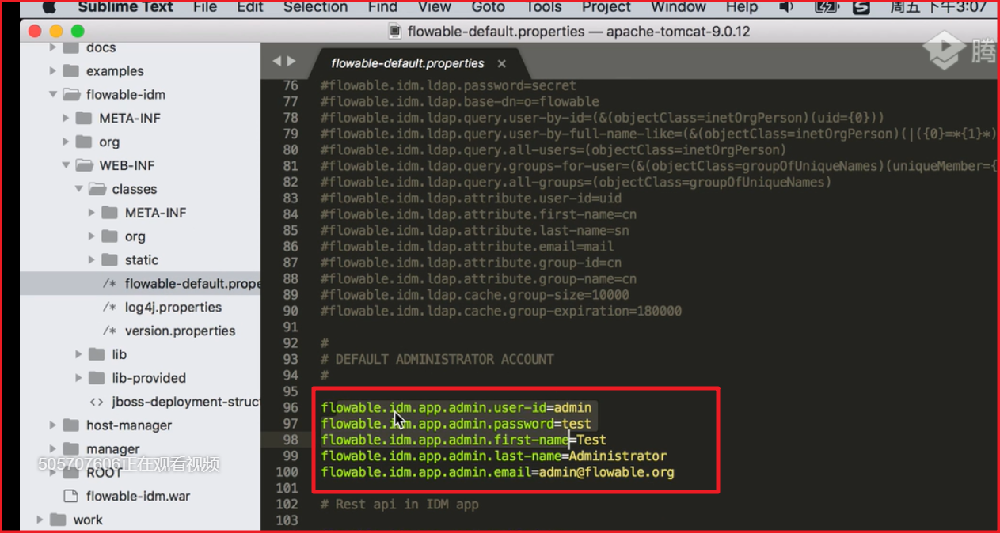

我们可以根据这个文件进行修改。

## 5-5将H2修改为MySql数据库

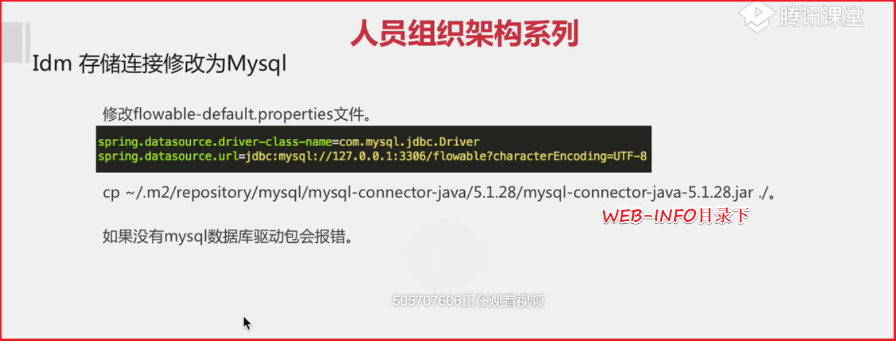

注意一定要把mysql驱动包放到WEB-INFO目录下。

## 6-4ProcessEngine相关服务及如何构造

通过flowable风格配置文件完成

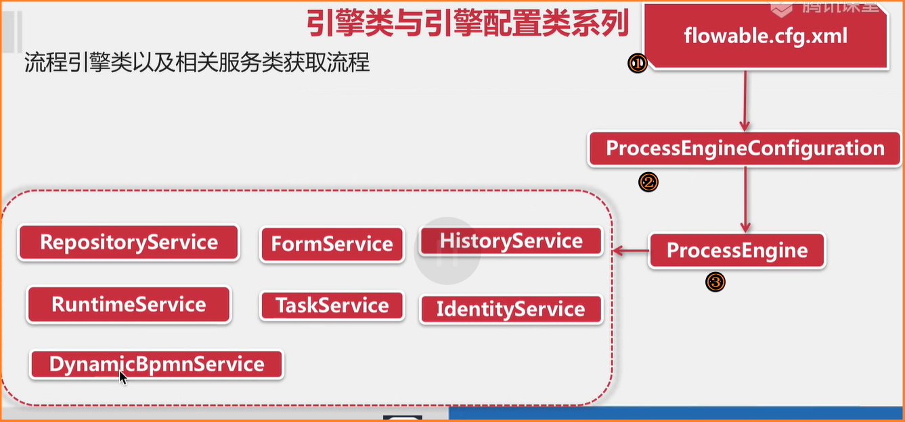

②就是引擎配置类

③引擎类

注意下面的红字!这里先记住就行了。

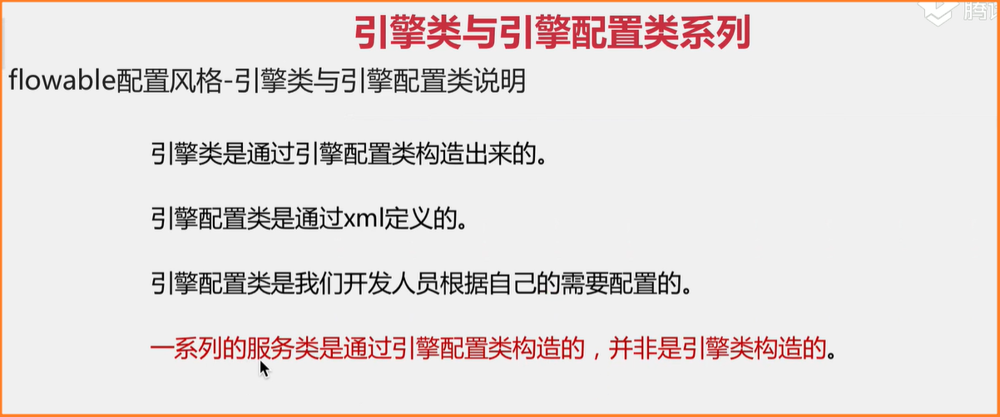

8大Service的作用

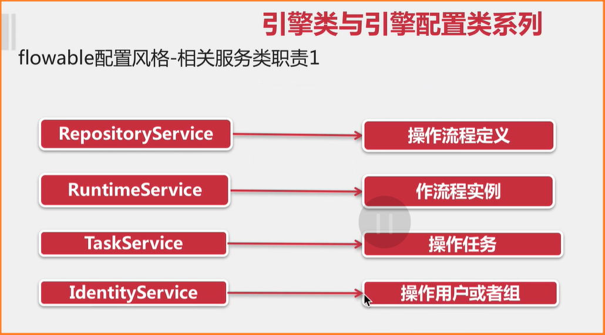

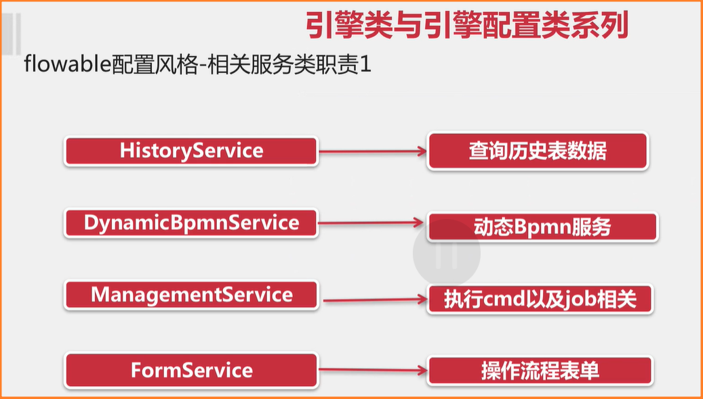

**重点**

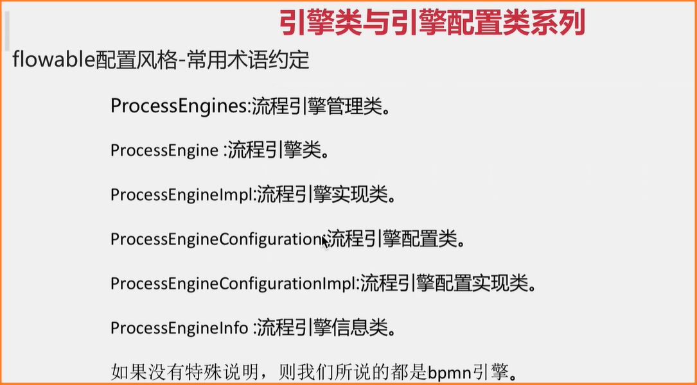

这里的bpmn引擎类,应该是与IDM等引擎类作区分的。bpmn引擎类就是我之前用activiti使用的那个ProcessEngine引擎类。

## 6-3打印flowable的sql

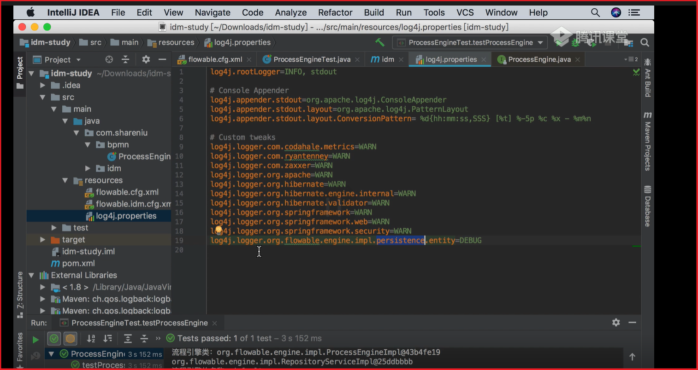

能够打印sql输出后,我们调试源码的老路就出来了。通过http请求找到controller,通过日志打印sql,找到操作的表。这样子调试源码会更方便一点。

## 6-5引擎类与引擎配置类

