# flowable 学习

## 源码怎么看

突然发现一个点,确切说是抽取方法的套路。方法的每一行的逻辑,除了流程的逻辑外,每一行的代码应该是同一层面的东西,比如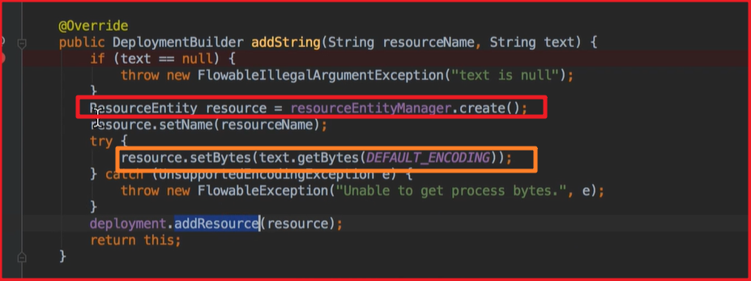

为什么要向上面这样封装呢?

仔细想想这样的可读性很高啊!就像里程碑一样,代码每执行到下一个逻辑行(不是分支行),就像是到了下一个里程碑一样。在高度上描述了事情一点一点的成立,也符合单一职责原则,每个方法只干好自己的事情。这样子写着写着复用性就上来了,代码的可读性也很高。想一想dnf的跑步活动,其实每个跑步的里程碑都做了很多的事情,但是反映到跑步界面,就只有一个一个的里程碑了。这样我们就能一目了然发现自己那次奔跑里程碑出了问题。再通过这个"里程碑"找到那周出了啥事情。完美啊。

而这样的代码别人在阅读的时候,也能根据里程碑定位我们想要研究的位置,而不用被蜂拥而至的代码吓到!

以后我自己在对方法进行抽取的时候,也要做到里程碑式抽取代码,做到单一职责原则抽取代码。当某个单一职责的代码能被多个子类复用的时候,我们就可以把这个方法抽象到父类中,再使用!

## flowable UI IDM 模块总览

我们可以通过IdmEngine操作IDM相关的表,也可以通过processEngin操作相关的表。

大体上IDM模块是一个RBAC模型,从角色-组-权限来限制或授予用户的访问权限。与普通RBAC模型不同的是,IDM模块的权限可以直接分配到某一个特定的用户。如图

可以看到权限-组中间表中也可以设置权限直接到用户的关系。

这里是权限相关关系。

如图,全向模块不光可以设置组(角色)还可以将权限直接对应到某个用户!

## IDM模块的H2数据库

如果我们想要连接IDM模块的H2数据库,必须要保证项目是启动的,否则连接不上H2数据库的。

大概有9张表

属性表中的数据一定不要删除

系统登录日志表如果将记录删除,那当前登录的用户就会被踢出。

以上9张表中有2张表在6.40版本被废弃了

注意,在项目启动的时候我们是没有办法删除h2的db文件的,想要删除db文件一定要先将项目关闭!

## 5-4H2清空及默认用户修改

H2数据库虽然是内存数据库,但是也会将数据保存在一个目录,内存数据库的含义应该是在内存中运行的数据库而不是把数据保存在内存的数据库。

项目一旦被关闭,就无法访问H2内嵌数据库了。

默认创建的管理员帐号

我们可以根据这个文件进行修改。

## 5-5将H2修改为MySql数据库

注意一定要把mysql驱动包放到WEB-INFO目录下。

## 6-4ProcessEngine相关服务及如何构造

通过flowable风格配置文件完成

②就是引擎配置类

③引擎类

注意下面的红字!这里先记住就行了。

8大Service的作用

**重点**

这里的bpmn引擎类,应该是与IDM等引擎类作区分的。bpmn引擎类就是我之前用activiti使用的那个ProcessEngine引擎类。

## 6-3打印flowable的sql

能够打印sql输出后,我们调试源码的老路就出来了。通过http请求找到controller,通过日志打印sql,找到操作的表。这样子调试源码会更方便一点。

## 6-5引擎类与引擎配置类源码分析

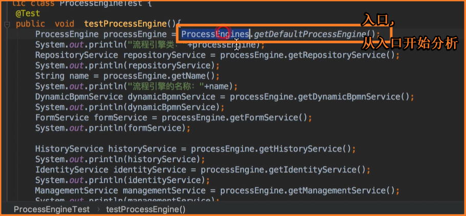

注意我们总是从入口开始分析代码。

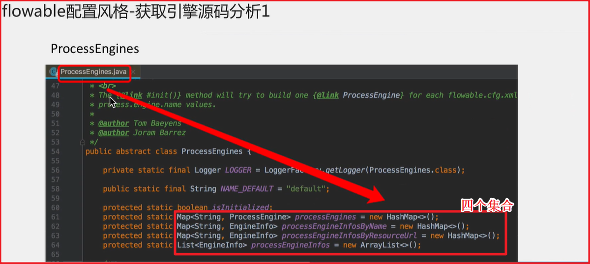

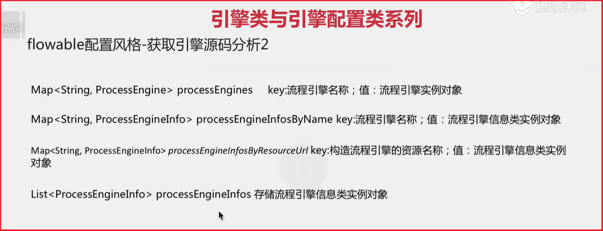

源码跟踪

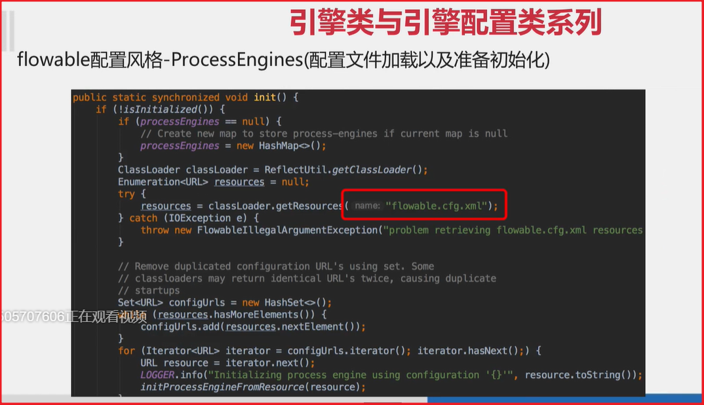

## 7-6流程文档部署方式

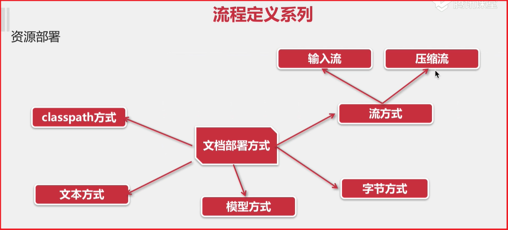

以上压缩流可以做到部署多个资源。比如,一个流程文档,一个流程文档对应的图片。

部署一个流程文档的套路如下

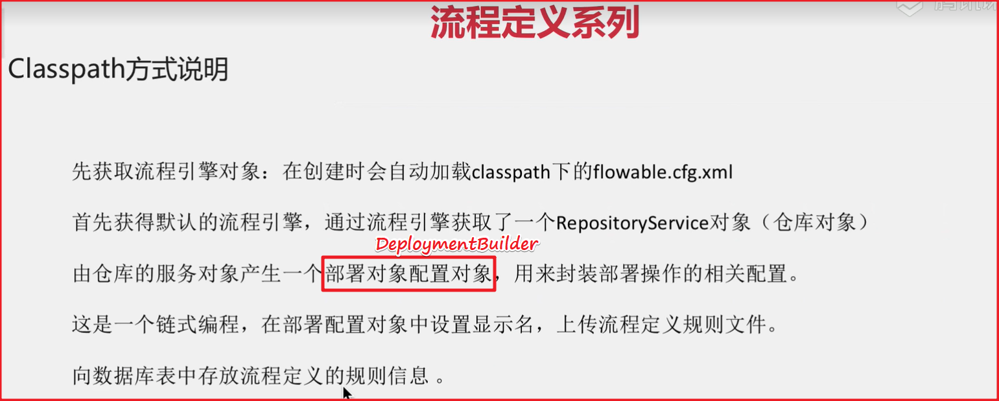

## 7-8流程部署影响的表

其实不同的方式进行部署,影响的表几乎是一样的,因为api在设计之初,他的终点就已经决定了,这也是结果导向的思维。

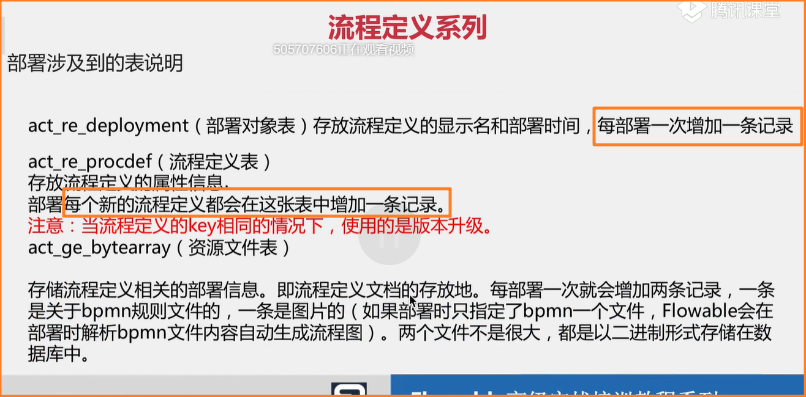

根据实际情况,就算是版本升级,每次部署,流程部署对象表与流程定义表都会新增一条记录卷后

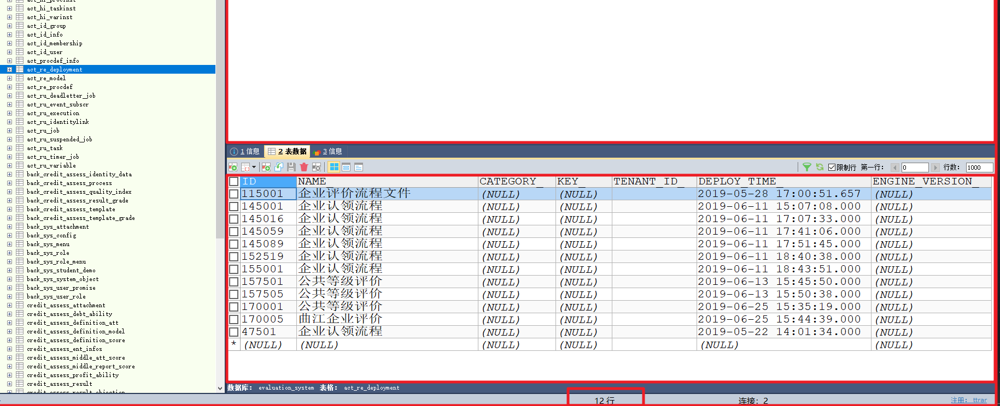

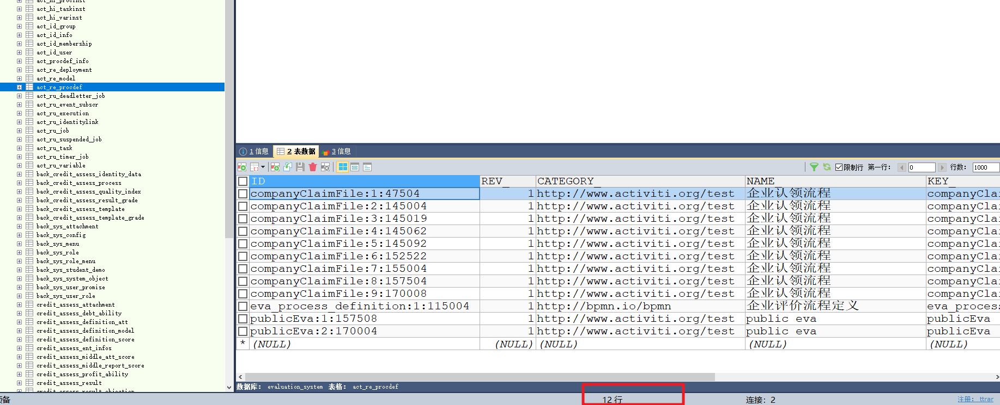

启动流程实例的时候查询的是act_re_prodef(流程定义表),如果这张表中没有数据,那就不能启动流程实例了!

以上情况与activiti6.x一致,activivti6根flowable5是一模一样的!而且为了把原本activiti的用户吸引过来,flowable会尽可能地向下兼容,所以肆无忌惮的联想的吧,没啥问题的。

## 7-9配置不生成图片及设置中文字体配置

我们可以设置flowable在部署的时候不自动生成图片。

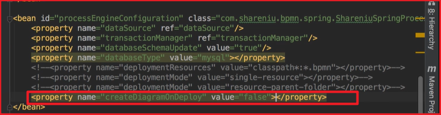

我们在生成图片的时候,通过开关属性能够设置生成字体的样式,比如宋体,黑体等,因为默认是英文字体,会有乱码问题。比如:

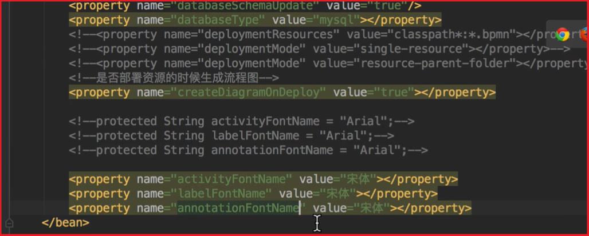